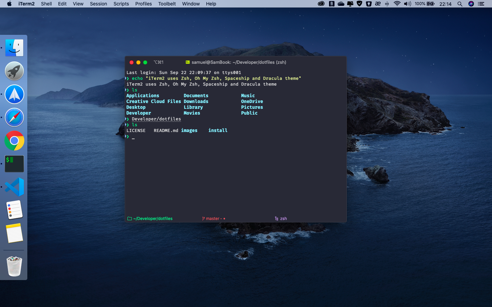

# Simple Dotfiles

This is a simple dotfiles and scripts to setup _macOS_.

## Table of Contents

1. [What are dotfiles](#what-are-dotfiles)
1. [Features](#features)
1. [Installation](#installation)
1. [Manual setup after installation](#manual-setup-after-installation)
1. [Screenshot](#screenshot)
1. [Resources](#resources)

## What are dotfiles

Dotfiles are configuration files on Unix-based systems. At first they are just hidden configuration files of the system (that's why the reason for starting with "."). However, we can use them to make it easier to configure our computers, with many advantages:

- Easy to format a new computer;
- Automation of tasks;
- Easy maintenance;
- Storage in remote locations (GitHub, Dropbox, etc);
- Versioning;
- Import to multiple computers;
- Customize the terminal.

## Features

_Check linked files to more details._

### Installation files:

- [apps.sh](install/apps.sh) - installs Homebrew, Cask, Homebrew Cask Upgrade and some basic apps.
- [dock.sh](install/dock.sh) - dock customization.
- [dotfiles.sh](install/dock.sh) - Zsh installer and git configs.
- [macos.sh](install/macos.sh) - macOS defaults configs.
- [npm.sh](install/npm.sh) - install npm packages.
- [setup.sh](install/setup.sh) - main installer.
- [util.sh](install/util.sh) - support functions for other installers.

**Note:** _These files will be discarded later._

### Settings Files:

- [gitconfig](.gitconfig) - basic git settings.
- [gitignore_global](.gitignore_global) - global gitignore.
- [zshrc](.zshrc) - terminal configs with aliases, paths, plugins and theme.

**Note:** _These files are permanent._

## Installation:

```
git clone https://github.com/samuelramox/dotfiles.git && cd dotfiles

./install/setup.sh
```

**Note:** You can also download a specific [release](https://github.com/samuelramox/dotfiles/releases).

### Explaining the process

The [setup.sh](install/setup.sh) process will ask if you want to install the following scripts, in this order:
**Note:** I suggest you read these files and turn your preferences on/off before installation.

- [apps.sh](install/apps.sh) - install _Homebrew_, _Cask Upgrade_ and applications.
  I suggest you comment apps that should not be installed and include those that are not listed. This script will install in the following order:

  - Install Homebrew;
  - Homebrew apps: Bash, Git, Nano, Node, nvm, Python, Ruby, Unrar, Yarn;
  - Homebrew cask fonts: caskroom/fonts, caskroom/drivers, caskroom/versions;
  - Homebrew casks: Adguard, Adobe Creative Cloud, CleanMyMac 3, Dash, Font Fira Code, Google Chrome, IINA, iStat Menus, iTerm2, Paragon NTFS, PDF Expert, qBittorrent, Spotify and VSCode;
  - Homebrew Cask Upgrade;

- [dotfiles.sh](install/dotfiles.sh) - install Zsh, Oh My Zsh, some Zsh plugins, Powerlevel10k theme, font Hack Nerd Font and z. Open [gitconfig](.gitconfig) so that the user can put his data.
- [npm.sh](install/npm.sh) - install some npm packages.
- [macos.sh](install/macos.sh) - set custom macOS preferences.
- [dock.sh](install/dock.sh) - install _dockutil_ and set custom permanent apps in Dock. _Finder_ and _Recycle Bin_ are already permanent (unless you change this).
- Generate _ssh_.
- Update _hostname_ (MacBook name).
- Create a directory called _Developer_ in _Home_ directory for projects and development.
- Cleanup cached downloads and remove the installation zip and folder.
- Enable _trimforce_ and reboot.

## Manual setup after installation

### iTerm2 - Change the color theme:  

iTerm → Preferences → Profiles → Colors → Color presets. I use Solarized Dark theme.

### iTerm2 - Change font:  

iTerm → Preferences → Profiles → Text → Change Font. I use Hack Nerd Font with 13px.

### iTerm2 - Enable word jumps and word deletion, aka natural text selection:  

By default, word jumps (option + → or ←) and word deletions (option + backspace) do not work. To enable these, go to: iTerm → Preferences → Profiles → Keys → Load Preset... → Natural Text Editing

### Visual Studio Code config:

Code → Preference → Settings (or CMD + ,) and add or edit the following values:  
`"terminal.integrated.fontFamily": "Hack Nerd Font"`  
`"terminal.integrated.fontSize": 14`

## Screenshot:

Standard installation (can be configured):


## Resources:

- [Dotfiles Repositories](https://dotfiles.github.io/)
- [Awesome Dotfiles](https://github.com/webpro/awesome-dotfiles)
- [Homebrew](https://brew.sh/)
- [Homebrew Cask Upgrade](https://github.com/buo/homebrew-cask-upgrade)
- [Dockutil](https://github.com/kcrawford/dockutil)
- [Sensible macOS defaults](https://github.com/mathiasbynens/dotfiles/blob/master/.macos)
- [Awesome OSX Command Line](https://github.com/herrbischoff/awesome-osx-command-line)
- [Oh My Zsh](https://github.com/robbyrussell/oh-my-zsh)
- [Powerlevel10k theme for Zsh](https://github.com/romkatv/powerlevel10k)
- [Nerd Fonts](https://nerdfonts.com/)
